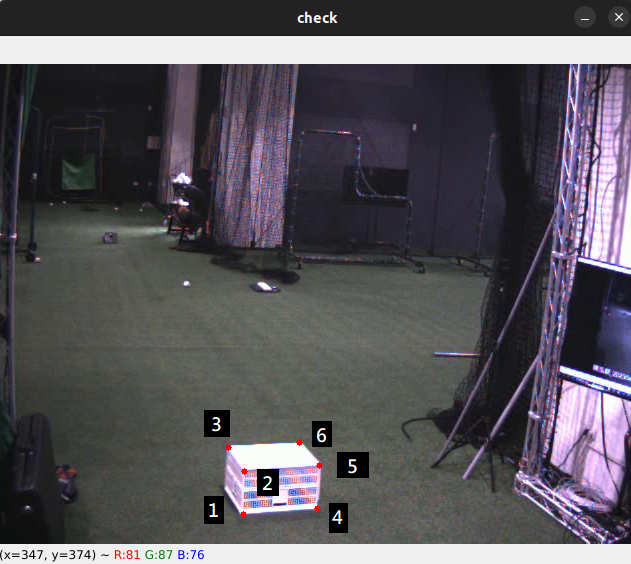

# 智慧牛棚 軌跡重建 子服務

## 環境

python 3.10

使用 yolov7 requirememts.txt (已放至 TRAJ_CALCULATE)

## 檔案介紹

- traj-calculator
    - [main.py](#main)
    - src
        - utils -> from yolov7 
        - models -> from yolov7
        - impl
            - [camera_calibration.sh](#camera_calibration) -> 校正相機參數
            - [get_img_coordinate.sh](#get_img_coordinate) -> 標記參考點
            - [draw_poly_and_fill.sh](#draw_poly_and_fill) -> 繪製遮罩 
            - [calib](#calib) -> 放參考點影片、檔案，和棋盤格校正後的檔案、遮罩的檔案
            - [target_data](#target_data) -> 最後生成的3D球點檔案
            - [weights](#weights) -> 放 yolov7 weights
            - [find_curve.py](#find_curve) -> 根據3D球點繪製最符合曲線
            - data.yaml -> 存放嵌入的檔案路徑及基本參數設定
            - 其他程式碼

## 新環境設定

這裡會需要設定三項檔案

- calib.npz : 參照 [camera_calibration](#camera_calibration) 的說明

- ref_coordinate.npy : 參照 [get_img_coordinate](#get_img_coordinate) 的說明

- poly.png : 參照 [draw_poly_and_fill](#draw_poly_and_fill) 的說明
    
    
---

## main

calculator.calculate 會使用到的參數

- left_video
- right_video
- middle_left_video
- middle_right_video
- skipping_interval1 -> 前半段(使用left, right 兩視角)每隔幾個 frame 偵測一次
- skipping_interval2 -> 後半段(使用 middle_left, middle_right 兩視角)每隔幾個 frame 偵測一次
    


## camera_calibration

**目的 ： 使用不同相機或鏡頭時，建立新的相機參數**

先拍攝一部棋盤格影片，將影片中全部的frame取出來，放至一資料夾中，這個資料夾的位置也就是我們 <input_images_folder> 這個 argument 所要輸入的字串

output_path 則是我們生成相機參數的檔案位置


```
$ . ./camera_calibration.sh <input_images_folder> <output_path> <棋盤格長> <棋盤格寬>
```


範例：
```
$ . ./camera_calibration.sh ./img_folder calibration.npz 7 5
```

## get_img_coordinate

**目的：繪製參考點在兩部影片的位置，以利重建3D位置**

這裡我們需要左右兩視角含有參考點的影片，位置為 left_video.mp4 , right_video.mp4 ，生成的檔案名稱為 left_video_coordinate.npy, right_video_coordinate.npy

```
$ . ./get_img_coordinate.sh <left_vieo.mp4> <right_video.mp4>
```


請注意，這裡會針對左右兩部影片分別進行操作

步驟：

1. 按 enter 鍵，會生成當下frame的視窗(名為 check)，我們將對此視窗進行操作 
2. 依序點出箱子的六個點，左下到左上 及 右下到右上，每個點可以利用AWDS來調整PIXEL位置
3. 六個點點完後，按下 Z 儲存檔案， Q 離開
4. 執行第二部影片，重複步驟1~3
5. 完成 reference coordinate 設定

  


## draw_poly_and_fill

**目的：將畫面中非投球路徑的部分做遮罩，減少這一部份的計算及其帶來的影響**

簡單來說，就是在畫面中順時針或逆時針畫一個多邊形，多邊形內必須包含軌跡可能行經路線

這裡我們需要左右兩視角的影片，位置為 left_video.mp4 , right_video.mp4 ，生成的檔案名稱為 left_video_poly.png, right_video_poly.png

```
$ . ./draw_poly_and_fill.sh <left_vieo.mp4> <right_video.mp4>
```


請注意，這裡會針對左右兩部影片分別進行操作

步驟：

1. 按 enter 鍵，會生成當下frame的視窗(名為 check)，我們將對此視窗進行操作 
2. 在畫面中點出一個多邊形，範圍涵蓋投球的路徑，以順時針或逆時針的方向繪製，並盡量將周圍不相關的物件排除在多邊形之外，每個點可以利用AWDS來調整PIXEL位置
3. 完成後，按下 Z 儲存檔案， Q 離開
4. 執行第二部影片，重複步驟1~3
5. 完成 reference coordinate 設定

 


## calib

- calib 開頭之 .npz 檔 : 相機參數檔案
- box_{xxx}_coordinate.npy : 參考點的座標資訊
- ktl_ref_coodinate_1.npy / ktl_ref_coodinate_2.npy : 參考點的座標資訊 (舊)


## target_data

- default_3d_targets.npz : demo 用，為了防止無軌跡等情況發生
- target_3d_coordinate.npz : 儲存當前投球軌跡的 3D 球點

## weights

目前使用 yolov7_baseball_ktl_4_view.pt

## find_curve

先執行 main.py ，此處會生成 ./src/impl/target_3d_coordinate.npz，這是curve fitting 會使用到的 data

```
$ cd /src/impl
$ python find_curve.py
```

將會秀出曲線圖並存檔在 /src/impl/curve.png，路徑目前都是寫死的，都可以做修改

## 新場景設定

這裡會需要設定三項檔案

- calib.npz : 參照 camera_calibration.sh 的說明

- ref_coordinate.npy : 參照 get_img_coordinate.sh 的說明

- poly.png : 參照 draw_poly_and_fill.sh 的說明

### camera_calibration.sh

**目的 ： 使用不同相機或鏡頭時，建立新的相機參數**

先拍攝一部棋盤格影片，將影片中全部的frame取出來，放至一資料夾中，這個資料夾的位置也就是我們 <input_images_folder> 這個 argument 所要輸入的字串

output_path 則是我們生成相機參數的檔案位置


```
$ . ./camera_calibration.sh <input_images_folder> <output_path> <棋盤格長> <棋盤格寬>
```


範例：
```
$ . ./camera_calibration.sh ./img_folder calibration.npz 8 5
```

### get_img_coordinate.sh

**目的：繪製參考點在兩部影片的位置，以利重建3D位置**

這裡我們需要左右兩視角含有參考點的影片，位置為 left_video.mp4 , right_video.mp4 ，生成的檔案名稱為 left_video_coordinate.npy, right_video_coordinate.npy

```
$ . ./get_img_coordinate.sh <left_vieo.mp4> <right_video.mp4>
```


請注意，這裡會針對左右兩部影片分別進行操作

步驟：

1. 按 enter 鍵，會生成當下frame的視窗(名為 check)，我們將對此視窗進行操作 
2. 依序點出箱子的六個點，左下到左上 及 右下到右上，每個點可以利用AWDS來調整PIXEL位置
3. 六個點點完後，按下 Z 儲存檔案， Q 離開
4. 執行第二部影片，重複步驟1~3
5. 完成 reference coordinate 設定

  


### draw_poly_and_fill.sh

**目的：將畫面中非投球路徑的部分做遮罩，減少這一部份的計算及其帶來的影響**

這裡我們需要左右兩視角的影片，位置為 left_video.mp4 , right_video.mp4 ，生成的檔案名稱為 left_video_poly.png, right_video_poly.png

```
$ . ./draw_poly_and_fill.sh <left_vieo.mp4> <right_video.mp4>
```


請注意，這裡會針對左右兩部影片分別進行操作

步驟：

1. 按 enter 鍵，會生成當下frame的視窗(名為 check)，我們將對此視窗進行操作 
2. 在畫面中點出一個多邊形，範圍涵蓋投球的路徑，以順時針或逆時針的方向繪製，並盡量將周圍不相關的物件排除在多邊形之外，每個點可以利用AWDS來調整PIXEL位置
3. 完成後，按下 Z 儲存檔案， Q 離開
4. 執行第二部影片，重複步驟1~3
5. 完成 reference coordinate 設定

 


